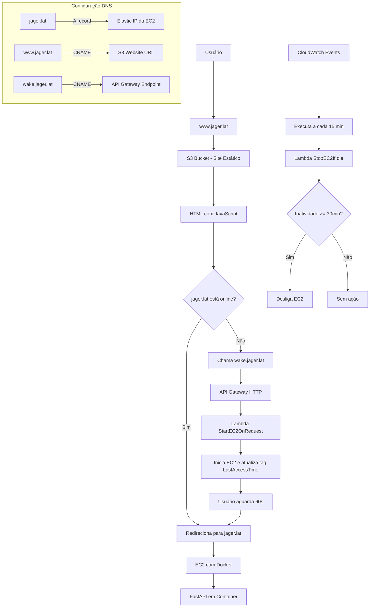

# Plano de Deployment da Aplicação

## 1. Introdução

Este plano descreve os passos adotados para disponibilizar a aplicação. Foi escolhida a hospedagem na AWS por ser um provedor de serviços consolidado e com vários recursos que no Free Tier é capaz de atender bem aos fins acadêmciso deste projeto. O projeto está utilizando:

- FastAPI rodando em um container Docker em uma instância EC2 (com Elastic IP) na AWS
- Uma página de wakeup hospedada em um bucket S3 da AWS, servida via domínio (www.jager.lat)
- Duas funções Lambda: uma para iniciar a EC2 via requisição e outra para desligar a EC2 automaticamente após 30 minutos sem atividade
- API Gateway HTTP para expor a função de "wake" da instância.
- CloudWatch Events (EventBridge) para agendar a função de desligamento automático
- Configuração de DNS no Namecheap para apontar o domínio e subdomínios corretos

O objetivo é que o domínio principal (jager.lat) sirva a aplicação quando a EC2 estiver ativa, e que, em caso de inatividade, a EC2 seja iniciada automaticamente mediante acesso ao site, além de ser desligada se não houver atividade por 30 minutos.

A escolha de Docker para a arquitetura foi feita visando padronizar o ambiente no qual a aplicação é executada, garantindo a integridade entre a execução durante o desenvolvimento e após publicação. A configuração no AWS usando funções Lambda visão controlar a execução e custos e recursos associados, limitando o uso apenas do necessário.



## 2. Arquitetura Geral

Componentes e Fluxo de Trabalho:

### EC2 com Docker:

- Hospeda a aplicação FastAPI dentro de um container
- Possui um Elastic IP para garantir que o endereço não mude

### S3 Bucket (Site Estático):

- Hospeda um arquivo HTML (página de "wakeup") com JavaScript
- Esta página verifica se a aplicação (jager.lat) está ativa e, caso não esteja, chama a função de wake

### API Gateway HTTP:

- Exposição de um endpoint público da AWS para acionar a Lambda StartEC2OnRequest

### Lambda Functions:

- **StartEC2OnRequest**: Inicia a instância EC2 e atualiza a tag LastAccessTime
- **StopEC2IfIdle**: Verifica, a cada 15 minutos, se a tag LastAccessTime não foi atualizada nos últimos 30 minutos e, se for o caso, desliga a instância

### CloudWatch Events (EventBridge):

- Agenda a execução da Lambda StopEC2IfIdle a cada 15 minutos

### DNS (Namecheap):

- **jager.lat**: Aponta para o Elastic IP da EC2 (aplicação real)
- **www.jager.lat**: Aponta via CNAME para o bucket S3 (página de wakeup)
- **wake.jager.lat**: Aponta via CNAME para o endpoint da API Gateway que chama a Lambda de wake

## 3. Pré-requisitos

- Conta AWS com permissões para EC2, Lambda, API Gateway, S3, CloudWatch e IAM
- Instância EC2 configurada com Ubuntu com GIT, Docker e Docker Compose instalados
- Elastic IP associado à instância
- Domínio registrado no Namecheap
- Roles configuradas corretamente para acesso dos serviços

## 4. Configuração dos Serviços AWS

### 4.1. Instância EC2

**Configuração da instância:**

- Criada uma instância na região us-east-2
- Instalação do GIT, Docker e Docker Compose
- Clonagem dos arquivos via repositório do GitHub
- Configuração para que a aplicação seja iniciada via docker-compose com a configuração de restart: always, dessa forma quando a máquina reiniciar, o container vai ficar "up" também.

**Elastic IP:**

- Atribição de um Elastic IP à instância para um endereço estático

**Grupo de Segurança:**

- Permitido o tráfego de entrada na porta 80 (HTTP) e 443 (HTTPS)

### 4.2. IAM Roles e Policies

**Para a Instância EC2 (para Update de Tags):**

- Foi criada uma policy que permita ec2:CreateTags na instância. Isso foi feito para que ao executar uma atividade, a aplicação em FastAPI atualize a informação indicando que ocorreu uma atividade e resetando o contador de tempo para parar a instância. Na aplicação isso foi feito através de um middleware. A seguir a policy utilizada:

```json
{
  "Version": "2012-10-17",
  "Statement": [
    {
      "Effect": "Allow",
      "Action": "ec2:CreateTags",
      "Resource": "arn:aws:ec2:us-east-2:726856122495:instance/i-080ad863d18ba54b4"
    }
  ]
}
```

- Criada uma role (EC2TaggingRole) para o EC2 e anexada a policy acima
- Role associada à instância EC2

**Para a Lambda StartEC2OnRequest:**

- Criada uma função Lambda com o código que liga a instância e marca a tag StartTime ou atualiza LastAccessTime
- A role da Lambda foi configurada com permissões para:
  - ec2:StartInstances
  - ec2:CreateTags
- Não foi restringido ao ARN da instância, mas isso poderia ser feito em caso de uma aplicação real, para evitar que seja possível outras fontes iniciando a instância EC2.

**Para a Lambda StopEC2IfIdle:**

- Criada uma função Lambda com o código que:
  - Lê a tag LastAccessTime (gerada pelo middleware da aplicação)
  - Compara com o horário atual e se a diferença for igual ou maior que 30 minutos, executa ec2:StopInstances
- A role desta Lambda também tem permissões para:
  - ec2:DescribeInstances
  - ec2:StopInstances

JSON da política:

```json
{
  "Version": "2012-10-17",
  "Statement": [
    {
      "Effect": "Allow",
      "Action": [
        "ec2:DescribeInstances",
        "ec2:StopInstances"
      ],
      "Resource": "*"
    }
  ]
}
```

### 4.3. CloudWatch Events (EventBridge)

Criada uma regra de agendamento:

- Tipo de regra: Schedule
- Expressão: rate(15 minutes)
- Target: Lambda StopEC2IfIdle

### 4.4. API Gateway

Criada uma API Gateway HTTP:

- API Type: HTTP API
- Name: WakeEC2API
- Integração: Configurada para a função Lambda StartEC2OnRequest
- Stage: $default
- Endpoint: [https://b8en7cep77.execute-api.us-east-2.amazonaws.com](https://b8en7cep77.execute-api.us-east-2.amazonaws.com)

### 4.5. Bucket S3 com Static Website Hosting

- Criado um bucket com o nome www.jager.lat
- Ativado o Static Website Hosting no bucket, definindo:
  - Index document: index.html
- Upload de um arquivo index.html com a lógica de verificação, que:
  - Tenta acessar jager.lat (para ver se a EC2 está online)
  - Se não estiver, chama o endpoint da API Gateway (usando fetch no modo no-cors) para acordar a EC2 e aguarda 60 segundos para redirecionar para jager.lat
- Configurada uma política de bucket para permitir acesso público:

```json
{
  "Version": "2012-10-17",
  "Statement": [
    {
      "Sid": "PublicReadGetObject",
      "Effect": "Allow",
      "Principal": "*",
      "Action": "s3:GetObject",
      "Resource": "arn:aws:s3:::www.jager.lat/*"
    }
  ]
}
```

### 4.6. Configuração de DNS no Namecheap

**Domínio principal (jager.lat):**

- Registrado um A record apontando para o Elastic IP da EC2 (18.189.79.249)

**Subdomínio www.jager.lat:**

- Alterado para ser um CNAME apontando para o bucket S3 (www.jager.lat.s3-website.us-east-2.amazonaws.com)

**Subdomínio wake.jager.lat:**

- Criado um CNAME apontando para o endpoint da API Gateway (b8en7cep77.execute-api.us-east-2.amazonaws.com)

## 5. Deployment do Código da Aplicação

### 5.1. Pull da solução via repositório Git

- Na instância EC2, foi feito o pull para utilizar o código desenvolvido e a imagem Docker foi reconstruída após cada iteração das atualizações e modificações:

```bash
git pull
docker-compose down
docker-compose build --no-cache
docker-compose up -d
```

## Conclusão

Este plano de deployment engloba a criação e configuração dos seguintes serviços AWS:

- EC2 para hospedar a aplicação em Docker, com Elastic IP
- S3 (static website) para a página de wake, usando o subdomínio www.jager.lat
- API Gateway HTTP para expor a função Lambda StartEC2OnRequest (subdomínio wake.jager.lat)
- Lambda Functions:
  - StartEC2OnRequest (para iniciar a instância e marcar a tag)
  - StopEC2IfIdle (para desligar a instância após 30 minutos de inatividade)
- CloudWatch Events (EventBridge) para agendar a função de desligamento
- DNS no Namecheap para gerenciar o domínio e subdomínios
