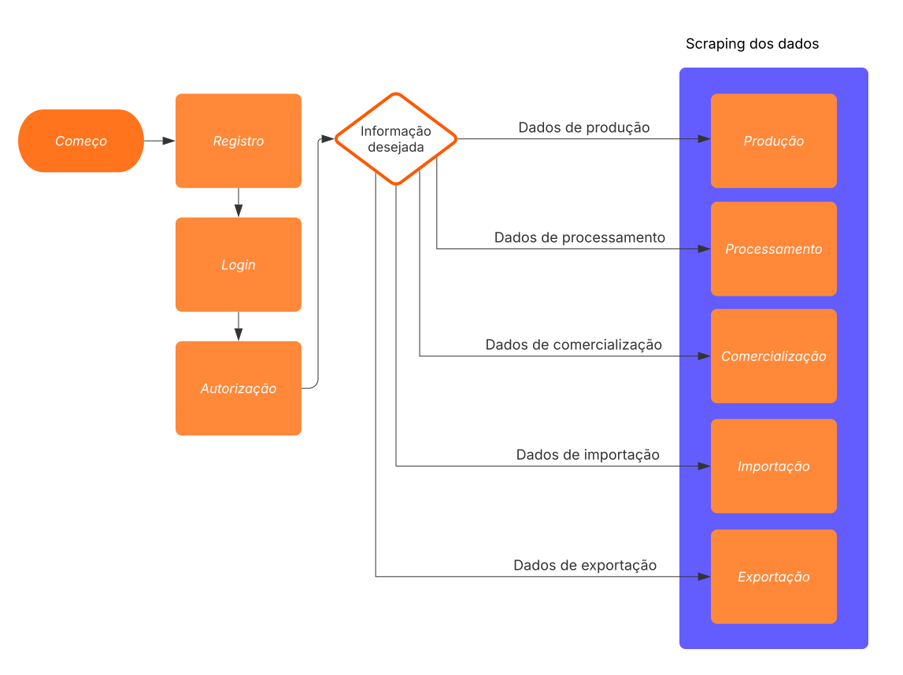

# Documentação da API

## Endpoints Principais

- **POST /login**: Autentica um usuário e retorna um token de acesso.
- **GET /production**: Retorna dados sobre a produção de vinhos, sucos e derivados.
- **GET /processing**: Retorna a quantidade de uvas processadas.
- **GET /commercialization**: Retorna dados sobre a comercialização de vinhos e derivados.
- **GET /importing**: Retorna dados sobre a importação de derivados de uva.
- **GET /exporting**: Retorna dados sobre a exportação de derivados de uva.


## Fluxo de uso da API

Uma vez que voce já tenha se [registrado](/registration), você precisa obter um **token** de autenticação tipo **Bearer** e utilizar esse token para todas as requisições subsequentes. Faça um **POST** para o endpoint **<u>/login</u>** com seu nome de usuário e senha. Como resposta voce terá o Bearer token.

Em posse do token, voce pode proceder com a requisição aos demais endpoints, passando via **GET** o ano do qual voce deseja obter os dados.




## Detalhes dos Endpoints

### 1. POST /login

#### Descrição
Autentica um usuário e retorna um token de acesso.

#### Parâmetros
- **username**: Nome de usuário (string, obrigatório).
- **password**: Senha do usuário (string, obrigatório).

#### Exemplo de Requisição

=== "C#"
    ```csharp
    using System.Net.Http;
    using System.Threading.Tasks;

    public async Task<string> Login(string username, string password)
    {
        using (var client = new HttpClient())
        {
            var values = new Dictionary<string, string>
            {
                { "username", username },
                { "password", password }
            };
    
            var content = new FormUrlEncodedContent(values);
            var response = await client.PostAsync("https://jager.lat/login", content);
            return await response.Content.ReadAsStringAsync();
        }
    }
    ```
=== "Python"
    ```python
    import requests

    def login(username, password):
        url = 'https://jager.lat/login'
        data = {'username': username, 'password': password}
        response = requests.post(url, data=data)
        return response.json()
    ```
=== "Javascript"
    ```javascript
    async function login(username, password) {
        const response = await fetch('https://jager.lat/login', {
            method: 'POST',
            headers: {
                'Content-Type': 'application/x-www-form-urlencoded',
            },
            body: new URLSearchParams({
                'username': username,
                'password': password
            })
        });
        return await response.json();
    }
    ```
=== "PHP"
    ```php
    function login($username, $password) {
        $url = 'https://jager.lat/login';
        $data = http_build_query(['username' => $username, 'password' => $password]);

        $options = [
            'http' => [
                'header' => "Content-Type: application/x-www-form-urlencoded\r\n",
                'method' => 'POST',
                'content' => $data,
            ],
        ];
    
        $context = stream_context_create($options);
        $result = file_get_contents($url, false, $context);
        return json_decode($result, true);
    }
    ```
=== "cURL"
    ```bash
    curl -X POST https://jager.lat/login \
        -H "Content-Type: application/x-www-form-urlencoded" \
        -d "username=usuario_exemplo&password=senha_exemplo"
    ```
=== "Ruby"
    ```ruby
    require 'net/http'
    require 'uri'

    def login(username, password)
        uri = URI.parse("https://jager.lat/login")
        request = Net::HTTP::Post.new(uri)
        request.set_form_data({"username" => username, "password" => password})
    
        response = Net::HTTP.start(uri.hostname, uri.port) do |http|
            http.request(request)
        end
        JSON.parse(response.body)
    end
    ```

#### Exemplo de Resposta

```json
{
  "access_token": "token_de_acesso",
  "token_type": "bearer"
}
```

### 2. GET /production
#### Descrição
Retorna dados sobre a produção de vinhos, sucos e derivados.

#### Parâmetros
- **year**: Ano de referência (integer, obrigatório).

#### Exemplo de Requisição

=== "C#"
    ```csharp
    public async Task<string> GetProduction(int year, string token)
    {
        using (var client = new HttpClient())
        {
            client.DefaultRequestHeaders.Authorization = new AuthenticationHeaderValue("Bearer", token);
            var response = await client.GetAsync($"https://jager.lat/production?year={year}");
            return await response.Content.ReadAsStringAsync();
        }
    }
    ```
=== "Python"
    ```python
    def get_production(year, token):
        url = f'https://jager.lat/production?year={year}'
        headers = {'Authorization': f'Bearer {token}'}
        response = requests.get(url, headers=headers)
        return response.json()
    ```
=== "Javascript"
    ```javascript
    async function getProduction(year, token) {
        const response = await fetch(`https://jager.lat/production?year=${year}`, {
            method: 'GET',
            headers: {
                'Authorization': `Bearer ${token}`
            }
        });
        return await response.json();
    }
    ```
=== "PHP"
    ```php
    function getProduction($year, $token) {
        $url = "https://jager.lat/production?year=$year";
        $options = [
            'http' => [
                'header' => "Authorization: Bearer $token\r\n",
                'method' => 'GET',
            ],
        ];

        $context = stream_context_create($options);
        $result = file_get_contents($url, false, $context);
        return json_decode($result, true);
    }
    ```
=== "cURL"
    ```bash
    curl -X GET "https://jager.lat/production?year=2020" \
        -H "Authorization: Bearer token_de_acesso"
    ```
=== "Ruby"
    ```ruby
    require 'net/http'
    require 'uri'

    def get_production(year, token)
        uri = URI.parse("https://jager.lat/production?year=#{year}")
        request = Net::HTTP::Get.new(uri)
        request["Authorization"] = "Bearer #{token}"
    
        response = Net::HTTP.start(uri.hostname, uri.port) do |http|
            http.request(request)
        end
        JSON.parse(response.body)
    end
    ```

#### Exemplo de Resposta

```json
[
  {
    "category": "VINHO DE MESA",
    "product": "Tinto",
    "quantity": 103916391,
    "unit": "L",
    "measurement": "volume",
    "year": 2020
  }
]
```

### 3. GET /processing
#### Descrição
Retorna a quantidade de uvas processadas.

#### Parâmetros
- **year**: Ano de referência (integer, obrigatório).

#### Exemplo de Requisição

=== "C#"
    ```csharp
    public async Task<string> GetProcessing(int year, string token)
    {
        using (var client = new HttpClient())
        {
            client.DefaultRequestHeaders.Authorization = new AuthenticationHeaderValue("Bearer", token);
            var response = await client.GetAsync($"https://jager.lat/processing?year={year}");
            return await response.Content.ReadAsStringAsync();
        }
    }
    ```
=== "Python"
    ```python
    def get_processing(year, token):
        url = f'https://jager.lat/processing?year={year}'
        headers = {'Authorization': f'Bearer {token}'}
        response = requests.get(url, headers=headers)
        return response.json()
    ```
=== "Javascript"
    ```javascript
    async function getProcessing(year, token) {
        const response = await fetch(`https://jager.lat/processing?year=${year}`, {
            method: 'GET',
            headers: {
                'Authorization': `Bearer ${token}`
            }
        });
        return await response.json();
    }
    ```
=== "PHP"
    ```php
    function getProcessing($year, $token) {
        $url = "https://jager.lat/processing?year=$year";
        $options = [
            'http' => [
                'header' => "Authorization: Bearer $token\r\n",
                'method' => 'GET',
            ],
        ];

        $context = stream_context_create($options);
        $result = file_get_contents($url, false, $context);
        return json_decode($result, true);
    }
    ```
=== "cURL"
    ```bash
    curl -X GET "https://jager.lat/processing?year=2020" \
        -H "Authorization: Bearer token_de_acesso"
    ```
=== "Ruby"
    ```ruby
    require 'net/http'
    require 'uri'

    def get_processing(year, token)
        uri = URI.parse("https://jager.lat/processing?year=#{year}")
        request = Net::HTTP::Get.new(uri)
        request["Authorization"] = "Bearer #{token}"
    
        response = Net::HTTP.start(uri.hostname, uri.port) do |http|
            http.request(request)
        end
        JSON.parse(response.body)
    end
    ```

#### Exemplo de Resposta

```json
[
  {
    "group": "Viníferas",
    "category": "TINTAS",
    "farm": "TIAlicante Bouschet",
    "quantity": 2272985,
    "unit": "Kg",
    "measurement": "mass",
    "year": 2020
  }
]
```

### 4. GET /commercialization
#### Descrição
Retorna dados sobre a comercialização de vinhos e derivados.

#### Parâmetros
- **year**: Ano de referência (integer, obrigatório).

#### Exemplo de Requisição

=== "C#"
    ```csharp
    public async Task<string> GetCommercialization(int year, string token)
    {
        using (var client = new HttpClient())
        {
            client.DefaultRequestHeaders.Authorization = new AuthenticationHeaderValue("Bearer", token);
            var response = await client.GetAsync($"https://jager.lat/commercialization?year={year}");
            return await response.Content.ReadAsStringAsync();
        }
    }
    ```
=== "Python"
    ```python
    def get_commercialization(year, token):
        url = f'https://jager.lat/commercialization?year={year}'
        headers = {'Authorization': f'Bearer {token}'}
        response = requests.get(url, headers=headers)
        return response.json()
    ```
=== "Javascript"
    ```javascript
    async function getCommercialization(year, token) {
        const response = await fetch(`https://jager.lat/commercialization?year=${year}`, {
            method: 'GET',
            headers: {
                'Authorization': `Bearer ${token}`
            }
        });
        return await response.json();
    }
    ```
=== "PHP"
    ```php
    function getCommercialization($year, $token) {
        $url = "https://jager.lat/commercialization?year=$year";
        $options = [
            'http' => [
                'header' => "Authorization: Bearer $token\r\n",
                'method' => 'GET',
            ],
        ];

        $context = stream_context_create($options);
        $result = file_get_contents($url, false, $context);
        return json_decode($result, true);
    }
    ```
=== "cURL"
    ```bash
    curl -X GET "https://jager.lat/commercialization?year=2020" \
        -H "Authorization: Bearer token_de_acesso"
    ```
=== "Ruby"
    ```ruby
    require 'net/http'
    require 'uri'

    def get_commercialization(year, token)
        uri = URI.parse("https://jager.lat/commercialization?year=#{year}")
        request = Net::HTTP::Get.new(uri)
        request["Authorization"] = "Bearer #{token}"
    
        response = Net::HTTP.start(uri.hostname, uri.port) do |http|
            http.request(request)
        end
        JSON.parse(response.body)
    end
    ```

#### Exemplo de Resposta

```json
[
  {
    "category": "VINHO DE MESA",
    "product": "Tinto",
    "quantity": 50000,
    "unit": "L",
    "measurement": "volume",
    "year": 2020
  }
]
```

### 5. GET /importing
#### Descrição
Retorna dados sobre a importação de derivados de uva.

#### Parâmetros
- **year**: Ano de referência (integer, obrigatório).

#### Exemplo de Requisição

=== "C#"
    ```csharp
    public async Task<string> GetImporting(int year, string token)
    {
        using (var client = new HttpClient())
        {
            client.DefaultRequestHeaders.Authorization = new AuthenticationHeaderValue("Bearer", token);
            var response = await client.GetAsync($"https://jager.lat/importing?year={year}");
            return await response.Content.ReadAsStringAsync();
        }
    }
    ```
=== "Python"
    ```python
    def get_importing(year, token):
        url = f'https://jager.lat/importing?year={year}'
        headers = {'Authorization': f'Bearer {token}'}
        response = requests.get(url, headers=headers)
        return response.json()
    ```
=== "Javascript"
    ```javascript
    async function getImporting(year, token) {
        const response = await fetch(`https://jager.lat/importing?year=${year}`, {
            method: 'GET',
            headers: {
                'Authorization': `Bearer ${token}`
            }
        });
        return await response.json();
    }
    ```
=== "PHP"
    ```php
    function getImporting($year, $token) {
        $url = "https://jager.lat/importing?year=$year";
        $options = [
            'http' => [
                'header' => "Authorization: Bearer $token\r\n",
                'method' => 'GET',
            ],
        ];

        $context = stream_context_create($options);
        $result = file_get_contents($url, false, $context);
        return json_decode($result, true);
    }
    ```
=== "cURL"
    ```bash
    curl -X GET "https://jager.lat/importing?year=2020" \
        -H "Authorization: Bearer token_de_acesso"
    ```
=== "Ruby"
    ```ruby
    require 'net/http'
    require 'uri'

    def get_importing(year, token)
        uri = URI.parse("https://jager.lat/importing?year=#{year}")
        request = Net::HTTP::Get.new(uri)
        request["Authorization"] = "Bearer #{token}"
    
        response = Net::HTTP.start(uri.hostname, uri.port) do |http|
            http.request(request)
        end
        JSON.parse(response.body)
    end
    ```

#### Exemplo de Resposta

```json
[
  {
    "group": "Vinhos de mesa",
    "country": "Alemanha",
    "quantity": 136992,
    "unit": "Kg",
    "measurement": "mass",
    "value": 504168,
    "currency": "US$",
    "year": 2020
  }
]
```

### 6. GET /exporting
#### Descrição
Retorna dados sobre a exportação de derivados de uva.

#### Parâmetros
- **year**: Ano de referência (integer, obrigatório).

#### Exemplo de Requisição

=== "C#"
    ```csharp
    public async Task<string> GetExporting(int year, string token)
    {
        using (var client = new HttpClient())
        {
            client.DefaultRequestHeaders.Authorization = new AuthenticationHeaderValue("Bearer", token);
            var response = await client.GetAsync($"https://jager.lat/exporting?year={year}");
            return await response.Content.ReadAsStringAsync();
        }
    }
    ```
=== "Python"
    ```python
    def get_exporting(year, token):
        url = f'https://jager.lat/exporting?year={year}'
        headers = {'Authorization': f'Bearer {token}'}
        response = requests.get(url, headers=headers)
        return response.json()
    ```
=== "Javascript"
    ```javascript
    async function getExporting(year, token) {
        const response = await fetch(`https://jager.lat/exporting?year=${year}`, {
            method: 'GET',
            headers: {
                'Authorization': `Bearer ${token}`
            }
        });
        return await response.json();
    }
    ```
=== "PHP"
    ```php
    function getExporting($year, $token) {
        $url = "https://jager.lat/exporting?year=$year";
        $options = [
            'http' => [
                'header' => "Authorization: Bearer $token\r\n",
                'method' => 'GET',
            ],
        ];

        $context = stream_context_create($options);
        $result = file_get_contents($url, false, $context);
        return json_decode($result, true);
    }
    ```
=== "cURL"
    ```bash
    curl -X GET "https://jager.lat/exporting?year=2020" \
        -H "Authorization: Bearer token_de_acesso"
    ```
=== "Ruby"
    ```ruby
    require 'net/http'
    require 'uri'

    def get_exporting(year, token)
        uri = URI.parse("https://jager.lat/exporting?year=#{year}")
        request = Net::HTTP::Get.new(uri)
        request["Authorization"] = "Bearer #{token}"
    
        response = Net::HTTP.start(uri.hostname, uri.port) do |http|
            http.request(request)
        end
        JSON.parse(response.body)
    end
    ```

#### Exemplo de Resposta

```json
[
  {
    "group": "Vinhos de mesa",
    "country": "França",
    "quantity": 50000,
    "unit": "Kg",
    "measurement": "mass",
    "value": 300000,
    "currency": "US$",
    "year": 2020
  }
]

```
