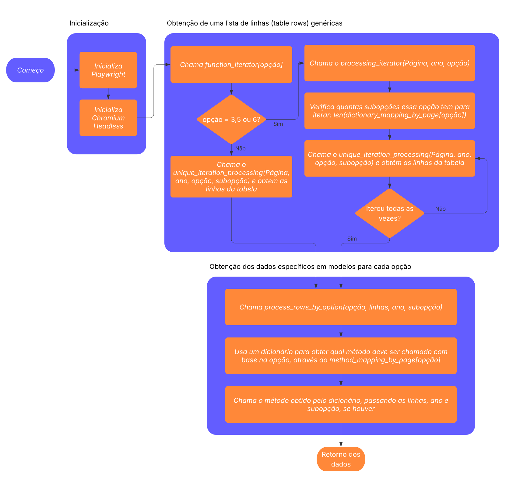

## Fluxo de Scraping

O fluxo de scraping é iniciado pela requisição à API. Quando um cliente faz uma requisição a um endpoint, o FastAPI direciona essa requisição para a função correspondente, pelo método run_scraping no arquivo `main_api.py`, onde os endpoints são definidos. Veja por exemplo a definição do endpoint de produção:

```python
@app.get("/production", summary="Produção de vinhos, sucos e derivados do Rio Grande do Sul", tags=["Production"],response_model=List[Production_or_Commercialization])
async def get_production(
    year: int = Query(..., description="Ano obrigatório"),
    user: dict = Depends(jwt_auth)
):
    try:
        productions = await run_scraping(year,'opt_02')
        return productions
    except Exception as e:
        raise HTTPException(status_code=500, detail=str(e))
```

O método run_scraping está definido no arquivo services.py. O fluxo de scraping está definido no fluxograma a seguir:



1. O Playwright é inicializado:

    ```python
    async with async_playwright() as p:
    ```

2. Uma instância do Chromium headless é inicializada:

    ```python
    browser = await p.chromium.launch(headless=True)
    ```

3. É chamado um dicionário chamado `function_iterator`, passando a opção solicitada via API como chave. Esse dicionário vai trazer como resposta um método para pegar os dados da página uma única vez, ou para pegar os dados da página várias vezes, alterando apenas o parâmetro subopção. Isso foi feito porque algumas páginas além da opção, tem a subopção, que seria uma variável referente a um menu no lado esquerdo que filtra os dados retornados em diferentes categorias. Para cada item que tiver nesse menu, se faz necessário repetir a obtenção dos dados. Porém algumas opçoes não tem subopções, então os dados apresentados na tabela já são todos os dados daquele ano. Basicamente as opções (opt_02, opt_04) que representam respectivamente "Produção" e "Comercialização" não tem subopções, então nesse caso o dicionário `function_iterator` vai retornar um método que é executado apenas uma vez (chamado de `unique_iteration_processing`). Para as demais opções, será retornado um método chamado `processing_iterator` que vai fazer um loop chamando várias vezes o mesmo método que é executado apenas uma vez pelas opções 2 e 4 (ou seja, ele vai ser responsável por chamar o `unique_iteration_processing` **N** vezes, sendo **N** o número de subopções que tem para cada opção).

    ```python
    func = function_iterator[option]
    ```

    Isso significa que caso não haja subopção (nas opções opt_02 e opt_04), o scraping será feito uma única vez por ano, por exemplo para o ano de 2020 e opção opt_02 (Produção), o Playwright fará scrap na url [http://vitibrasil.cnpuv.embrapa.br/index.php?ano=2020&opcao=opt_02](http://vitibrasil.cnpuv.embrapa.br/index.php?ano=2020&opcao=opt_02). Porém para o ano de 2020 e opção opt_03 (Processamento), o Playwright fará scrap na url [http://vitibrasil.cnpuv.embrapa.br/index.php?ano=2020&opcao=opt_02&subopcao=subopt_01](http://vitibrasil.cnpuv.embrapa.br/index.php?ano=2020&opcao=opt_02&subopcao=subopt_01) , juntará os dados com o scrap da url [http://vitibrasil.cnpuv.embrapa.br/index.php?ano=2020&opcao=opt_02&subopcao=subopt_02](http://vitibrasil.cnpuv.embrapa.br/index.php?ano=2020&opcao=opt_02&subopcao=subopt_02) e assim por diante, até finalizar todas as subopções e o método processing_iterator, obtido pelo dicionário function_iterator será responsável por gerenciar isso e unificar todas as linhas da tabela.

4. O método `uniquer_iteration_processing` chama o método `process_rows_by_option`:

    ```python
    processed_data = await process_rows_by_option(option, rows, valid_year, subopt)
    ```

    E o `process_rows_by_option` utiliza um outro dicionário para obter qual lógica de scraping vai ser utilizada (dado que temos diferentes lógicas com base em qual opção estamos obtendo) e já chamar a lógica decidida.

    ```python
    async def process_rows_by_option(option: str, rows: List[Locator], year: int, subopt: Optional[int]):
        try:
            func = method_mapping_by_page[option]
            result = await func(rows, year,subopt)
            return result
        except KeyError:
            raise ValueError(f"Option '{option}' not implemented.")
    ```

    Então a variável `func` recebe o método a ser chamado e a variável `result` já recebe o retorno da execução do respectivo método para a opção fornecida, sendo agregado com iterações anteriores caso elas existam e retornado para a API.


### Uso de Dicionários

Os serviços fazem uso de dicionários definidos tanto no `services.py` e principalmente no arquivo `mappers.py` para mapear opções de scraping a grupos de dados ou métodos. Esses dicionários ajudam a organizar e simplificar o código, permitindo que os serviços acessem rapidamente as informações necessárias para processar as requisições sem diversas estruturas condicionais (aninhamento de ifs e elses ou switchs case).

